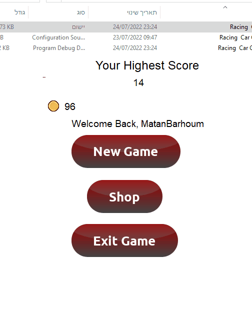

# C# OOP Race Car Game With Database (Create, Read, Update)

A race car game project I have been working on the last day.  

<h2>Includes</h2> 
<ul>
<li>Fully functional Database (Create, Read, Update) using SQL Server</li>
<li>A simple logic game to calculate score (every 50 in distance, score++), using distanceCovered % 50 to calculate and return a true \ false value and then increase the value of score. 
The car can move left, right using the Arrow keys. when UP arrow key is being pressed, the speed will increase, as well as the object. the distance will increase faster and the panels will move faster.  
Touching the borders of the forms or the astroieds will end the game and take you to game over screen. you can return to main menu or restart the game.  
Login and Register Fully working authentication. You can't register if there is another person with that username, and will not register you if password or username is blank.  
upon login screen, it will check username and password. if username or password is incorrect a error message will popup.</li>
<li>High Score + Coins System</li>
</ul>

<h2>Demo</h2>
<h3>Login Demo</h3>

<h3>Login + Register Demo</h3>

<h3>Authentication</h3>

<h3>Game + Game Over</h3>

<h3>High Score System</h3>

